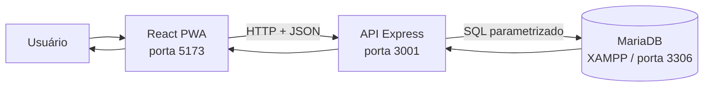
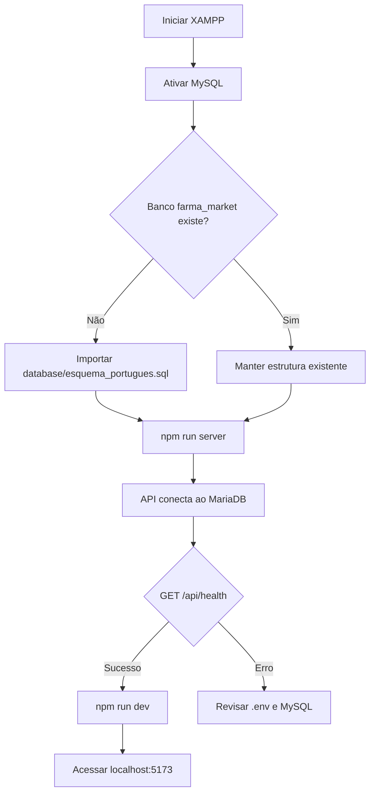
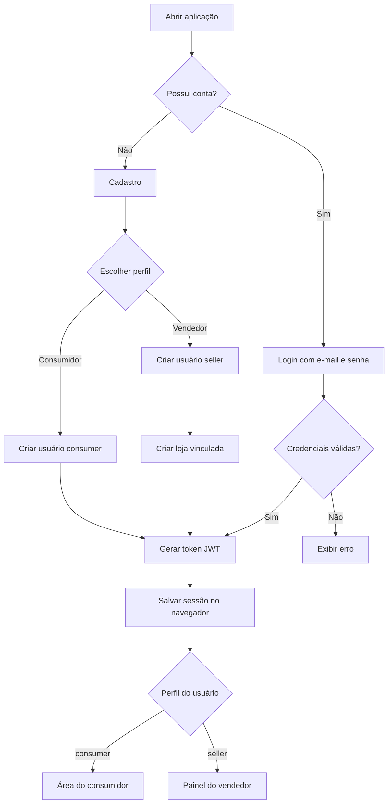
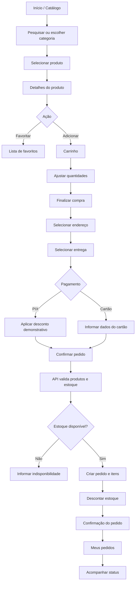
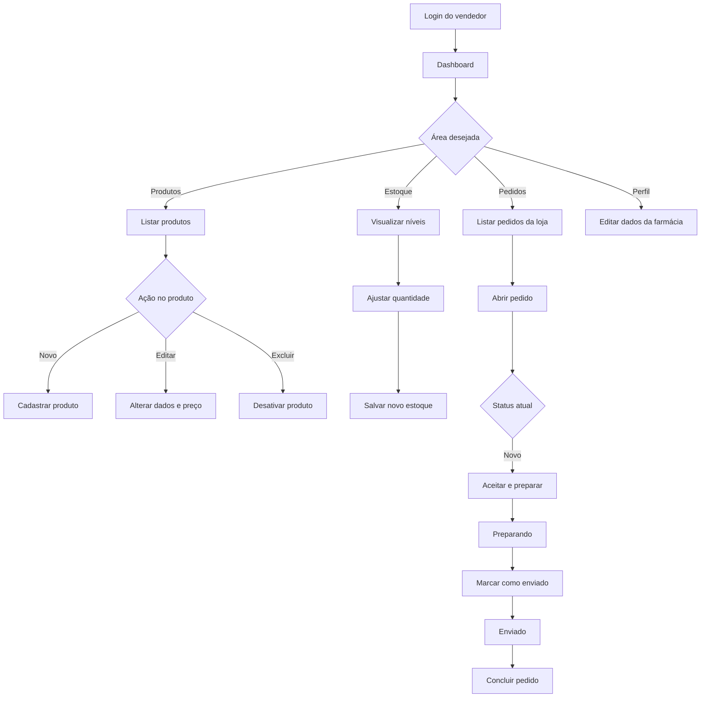
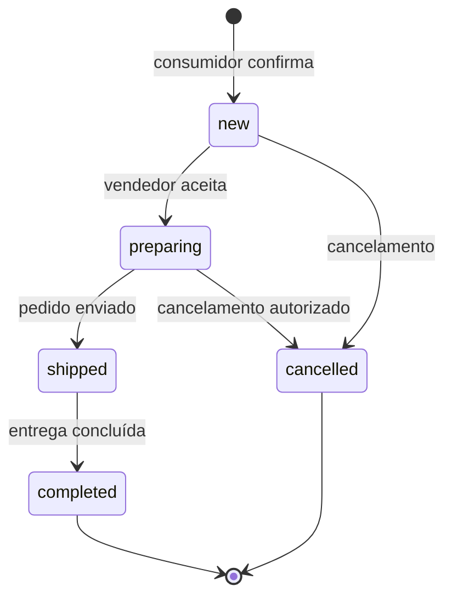
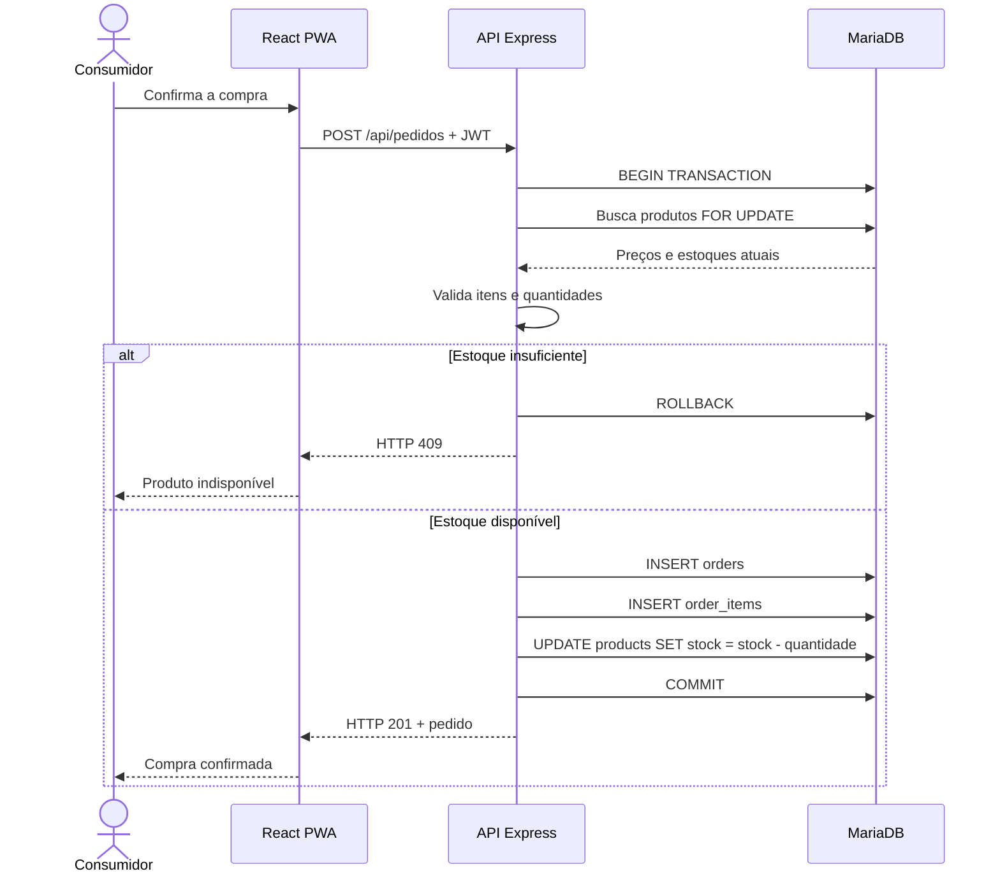
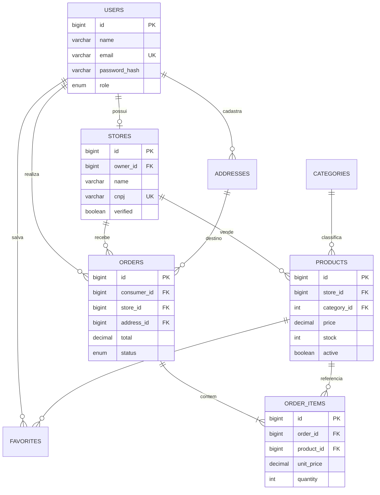
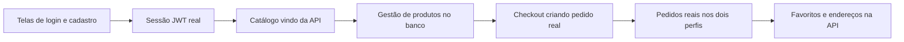

# Farma&Farma — Fluxograma e documentação funcional

## 1. Visão geral

O Farma&Farma é um marketplace PWA que conecta consumidores a farmácias vendedoras. A mesma aplicação oferece dois perfis:

- **Consumidor:** pesquisa produtos, cria favoritos, compra e acompanha pedidos.
- **Vendedor:** mantém a loja, cadastra produtos, controla estoque e processa pedidos.

O projeto possui três camadas principais:



### Tecnologias

| Camada | Tecnologias | Responsabilidade |
|---|---|---|
| Frontend | React, TypeScript, Vite | Interface, navegação e experiência PWA |
| PWA | Service Worker, Web Manifest | Instalação e cache da aplicação |
| Backend | Node.js, Express | Regras de negócio e API REST |
| Autenticação | JWT, bcrypt | Sessões e proteção das senhas |
| Banco | MariaDB, XAMPP | Persistência de usuários, lojas, produtos e pedidos |

## 2. Inicialização do sistema



Comandos necessários:

```powershell
# Terminal 1
npm run server

# Terminal 2
npm run dev
```

## 3. Acesso e autenticação



### Segurança da sessão

1. A senha chega à API somente durante cadastro ou login.
2. No cadastro, a senha é transformada em hash com bcrypt.
3. No login, bcrypt compara a senha enviada com o hash armazenado.
4. A API gera um JWT contendo o ID e o perfil do usuário.
5. O frontend envia o token em `Authorization: Bearer <token>`.
6. O backend verifica o token e a permissão antes de executar rotas protegidas.

## 4. Fluxo do consumidor



### Páginas do consumidor

| Página | Função |
|---|---|
| Início | Apresentar categorias, ofertas e catálogo |
| Detalhes do produto | Mostrar preço, farmácia, avaliação e entrega |
| Favoritos | Manter produtos de interesse |
| Carrinho | Alterar quantidades e revisar subtotal |
| Checkout | Definir endereço, entrega e pagamento |
| Pedido confirmado | Informar número e previsão de entrega |
| Meus pedidos | Exibir histórico e progresso das compras |
| Minha conta | Editar dados pessoais e endereços |

## 5. Fluxo do vendedor



### Ciclo de status do pedido



No frontend, os status são apresentados como:

| Banco/API | Interface |
|---|---|
| `new` | Novo |
| `preparing` | Preparando |
| `shipped` | Enviado / Em trânsito |
| `completed` | Concluído / Entregue |
| `cancelled` | Cancelado |

## 6. Criação do pedido e controle de estoque

A criação do pedido acontece dentro de uma transação no banco para impedir inconsistências.



O preço salvo em `order_items.unit_price` é uma fotografia do preço no momento da compra. Se o vendedor alterar o produto posteriormente, pedidos antigos preservam o valor original.

## 7. Modelo de dados



### Relacionamentos principais

- Um vendedor possui uma loja.
- Uma loja possui vários produtos e recebe vários pedidos.
- Um consumidor possui endereços, favoritos e pedidos.
- Um pedido pertence a uma loja. Nesta versão, cada pedido contém itens da mesma farmácia.
- Um pedido possui vários itens, e cada item referencia o produto original quando ele ainda existe.
- A exclusão de produto é lógica: o registro recebe `active = 0` para preservar o histórico.

## 8. Endpoints da API

### Públicos

| Método | Endpoint | Função |
|---|---|---|
| `GET` | `/api/health` | Testar API e banco |
| `POST` | `/api/auth/register` | Cadastrar consumidor ou vendedor |
| `POST` | `/api/auth/login` | Autenticar usuário |
| `GET` | `/api/produtos` | Listar e filtrar produtos |
| `GET` | `/api/produtos/:id` | Consultar produto |

### Usuário autenticado

| Método | Endpoint | Função |
|---|---|---|
| `GET` | `/api/me` | Consultar perfil atual |
| `PUT` | `/api/me` | Atualizar perfil |
| `GET` | `/api/pedidos` | Listar pedidos conforme o perfil |
| `GET` | `/api/pedidos/:id` | Consultar detalhes do pedido |

### Consumidor

| Método | Endpoint | Função |
|---|---|---|
| `POST` | `/api/pedidos` | Criar pedido e descontar estoque |

### Vendedor

| Método | Endpoint | Função |
|---|---|---|
| `GET` | `/api/vendedor/farmacia` | Consultar loja do vendedor |
| `PUT` | `/api/vendedor/farmacia` | Atualizar loja |
| `POST` | `/api/vendedor/produtos` | Cadastrar produto |
| `PUT` | `/api/vendedor/produtos/:id` | Atualizar produto e estoque |
| `DELETE` | `/api/vendedor/produtos/:id` | Desativar produto |
| `PATCH` | `/api/vendedor/pedidos/:id/situacao` | Atualizar status do pedido |

## 9. Organização dos arquivos

```text
Farma&Farma/
├── database/
│   └── esquema_portugues.sql              # Estrutura e dados iniciais
├── docs/
│   └── FLUXOGRAMA_DO_PROJETO.md
├── public/                     # Ícones e arquivos públicos da PWA
├── server/
│   ├── autenticacao.js                 # JWT e autorização por perfil
│   ├── banco.js                   # Pool de conexões MariaDB
│   ├── servidor.js               # Rotas e regras de negócio
│   └── README.md
├── src/
│   ├── api.ts                  # Cliente HTTP do frontend
│   ├── Aplicacao.tsx                 # Páginas e fluxos da aplicação
│   ├── data.ts                 # Dados visuais demonstrativos
│   ├── styles.css              # Estilos gerais e vendedor
│   ├── consumidor.css            # Estilos do consumidor
│   └── principal.tsx                # Inicialização do React/PWA
├── .env                        # Configuração local, ignorada pelo Git
├── .env.example                # Modelo de configuração
├── package.json
└── vite.config.ts
```

## 10. Estado atual e próxima integração

O backend, o banco e o cliente HTTP estão preparados. Algumas telas do frontend ainda usam dados demonstrativos e `localStorage`. A integração definitiva deve seguir esta ordem:



## 11. Regras importantes para produção

- Alterar `JWT_SECRET` para uma chave longa, aleatória e privada.
- Configurar senha no usuário do MariaDB; não usar `root` em produção.
- Usar HTTPS.
- Integrar um provedor de pagamento; nunca armazenar número ou CVV de cartão.
- Validar entrada da API com uma biblioteca de schemas.
- Adicionar limitação de requisições, logs e auditoria.
- Armazenar imagens em serviço próprio de arquivos, não diretamente no banco.
- Criar políticas de cancelamento, devolução, medicamentos controlados e prescrição.
- Separar pedidos automaticamente quando o carrinho tiver produtos de lojas diferentes.
- Criar migrations e backups automatizados antes de evoluir o schema.

## 12. Contas locais de demonstração

| Perfil | E-mail | Senha |
|---|---|---|
| Consumidor | `marina@farma.local` | `123456` |
| Vendedor | `vendedor@farma.local` | `123456` |

Essas credenciais devem existir somente no ambiente de desenvolvimento.
